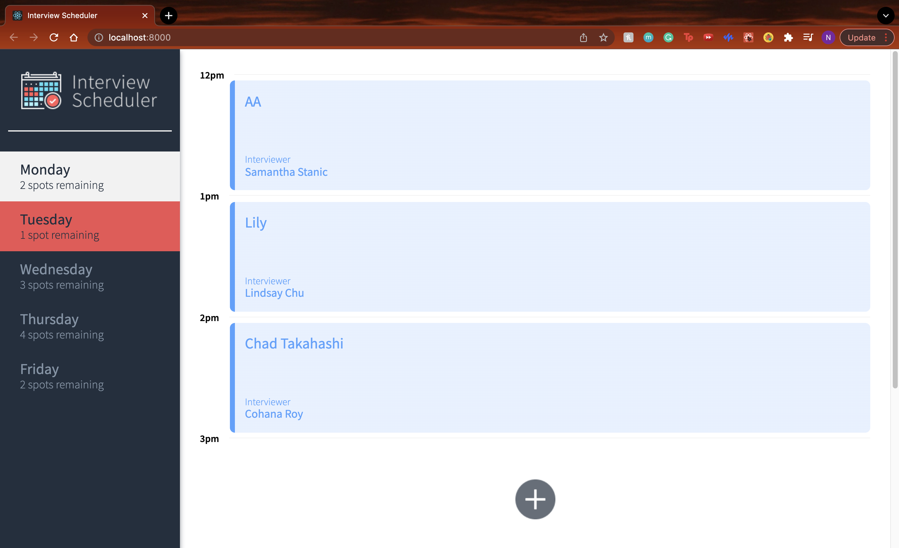
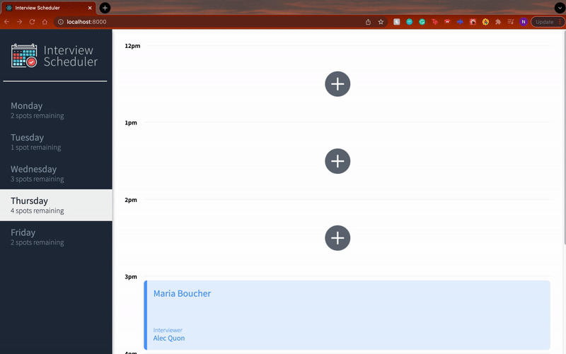
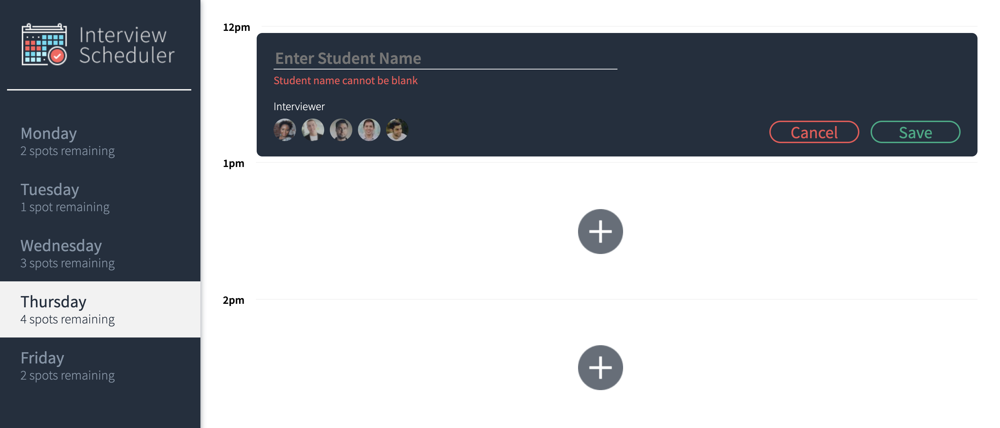
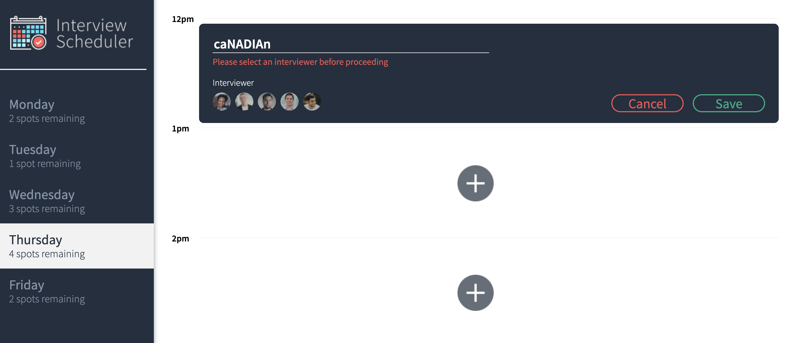

# Interview Scheduler

This single-page web app built using React allows a user to create, edit and delete interview appointments.

This app uses Express and two servers which run at the same time whereby requests are proxied between the two:
* **Scheduler API** which can be found here: https://github.com/canadiankay/scheduler-api
* the Webpack development server to this API server.

This app has undergone testing using Storybook, Jest and Cypress.

### The Finished Product

#### Error Handling Messages

## Setup

Install dependencies with `npm install`.

## Running Webpack Development Server

npm start

## Running Jest Test Framework

npm test

## Running Storybook Visual Testbed

npm run storybook

## Dependencies
* axios
* classnames
* normalize.css
* react 

